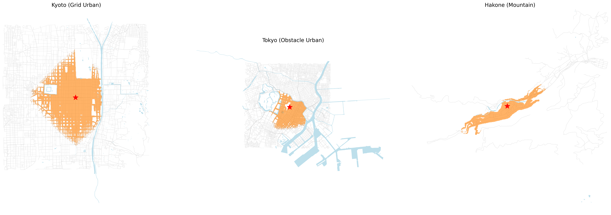
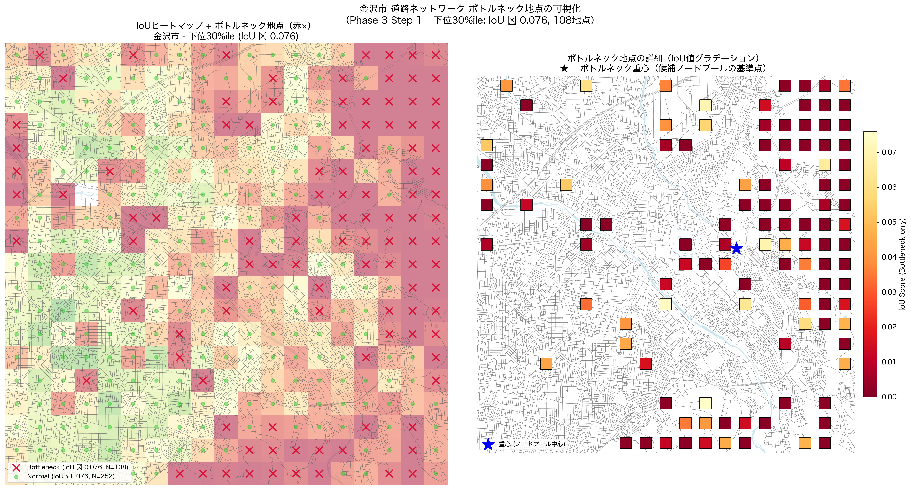
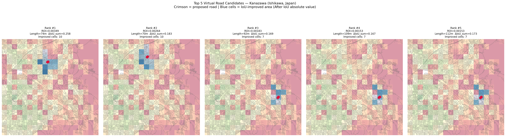

# reachability_model

都市道路ネットワークの到達可能性を評価し、交通効率の低い地点や新規道路候補を分析するプロジェクトです。

## 目的

道路ネットワークの形状や川・山などの地理的障害によって、都市内の移動しやすさは大きく変わります。このプロジェクトでは、OpenStreetMap の道路データを使い、ある地点から一定距離内でどれだけ広い範囲に到達できるかを評価しました。

## 主な内容

- 到達可能範囲の面積評価
- Convex Hull、メッシュ、コストラスタの比較
- 川や山などの障害物を考慮したコストラスタ評価
- 金沢市を対象とした到達効率ヒートマップ
- ボトルネック地点の抽出
- 新規道路・橋の候補を効果と距離コストで評価

## ディレクトリ構成

```text
reachability_model/
├── src/             # 分析・可視化・最適化用スクリプト
├── docs/            # 公開用に整理した技術説明
├── images/          # 実験結果の可視化画像
└── requirements.txt # Python依存ライブラリ
```

## 実行例

```bash
pip install -r requirements.txt
python src/evaluate_cost_raster.py
python src/generate_city_heatmap.py
python src/visualize_bottleneck.py
python src/optimize_road.py
```

各スクリプトは OpenStreetMap から対象地域の道路データを取得して分析するため、実行時にはネットワーク接続が必要になる場合があります。

## 出力ファイルについて

公開版では、ローカル環境に依存する絶対パスを使わないようにし、各スクリプトの出力画像は `reachability_model/images/` 以下に保存されるようにしています。

## 結果画像








## ライセンス上の注意

このプロジェクトでは OpenStreetMap データを利用します。利用・公開時には OpenStreetMap contributors への帰属表示と ODbL の条件に注意してください。
