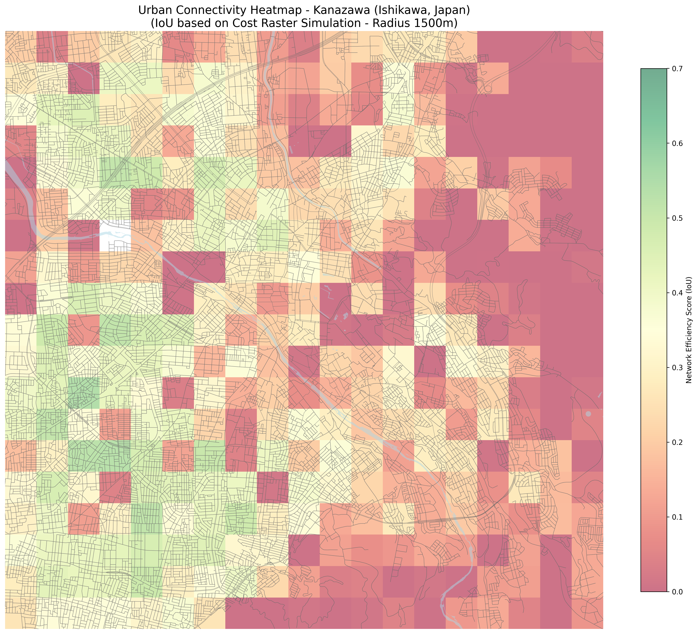

# 到達効率ヒートマップ

## 概要

金沢市を対象に、複数の地点から一定距離内で到達できる範囲を評価し、都市内の到達効率をヒートマップとして可視化しました。

## 評価の考え方

```text
到達効率 = 実際に到達しやすい面積 / 理論上の到達可能円の面積
```

値が高いほど、周辺に均質な道路ネットワークがあり、移動しやすいことを意味します。値が低い地点は、川・山・道路密度の低さなどによって移動が制約されている可能性があります。

## 結果



## 解釈

- 市街地中心部では道路ネットワークが密で、到達効率が比較的高くなります。
- 河川や地形的な分断がある場所では、近くに見えても実際の移動経路が限られるため、到達効率が下がります。
- 山間部では道路が細く少ないため、到達範囲が細長くなりやすく、面積評価では低く出ます。
