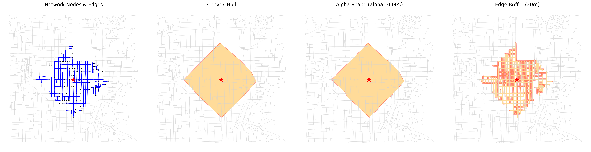
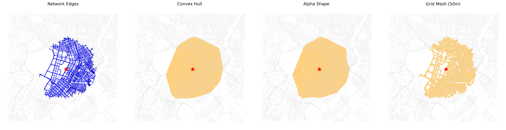

# 到達範囲ポリゴン化手法の比較

## 比較した手法

| 手法 | 概要 | 課題 |
|---|---|---|
| Convex Hull | 到達ノード全体を外側から囲む | 川や障害物をまたぎやすい |
| Alpha Shape | 凹みを考慮した外形を作る | パラメータ依存が大きい |
| Edge Buffer | 到達道路を一定幅で太らせる | 面としての広がりを表しにくい |
| Grid Mesh | 道路と交差するメッシュを数える | メッシュサイズに結果が左右される |
| Cost Raster | 空間全体に移動コストを与える | 設定と計算量に注意が必要 |

## 比較結果

## 採用判断

最終的には、地形的障害や道路密度の違いを扱いやすいコストラスタ方式を採用しました。
