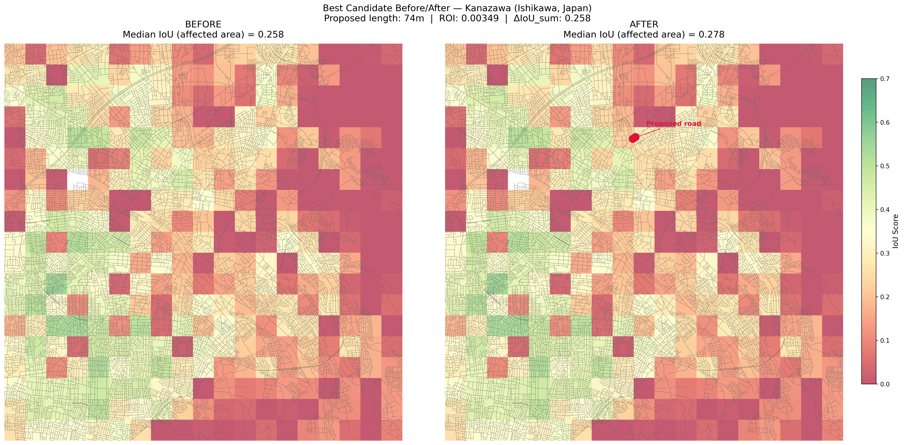

# 到達可能性分析の結果

## 概要

都市道路ネットワークの構造をもとに、移動しやすさを定量的に評価しました。特に、道路密度だけでは見えにくい地理的分断やボトルネックを可視化することを目指しました。

## 主な成果

- 道路ネットワークから到達可能範囲を評価する複数手法を比較した
- 川・山・道路密度の低さを考慮できるコストラスタ方式を採用した
- 金沢市を対象に到達効率ヒートマップを作成した
- 到達効率が低い地点を抽出した
- 新規道路・橋の候補を効果と距離コストで評価した

## 結果画像

## 学んだこと

道路ネットワーク分析では、単純な距離や道路密度だけでは都市の移動しやすさを十分に表せません。川・山・大規模施設などによって、近くに見える場所でも実際には移動しにくいことがあります。
